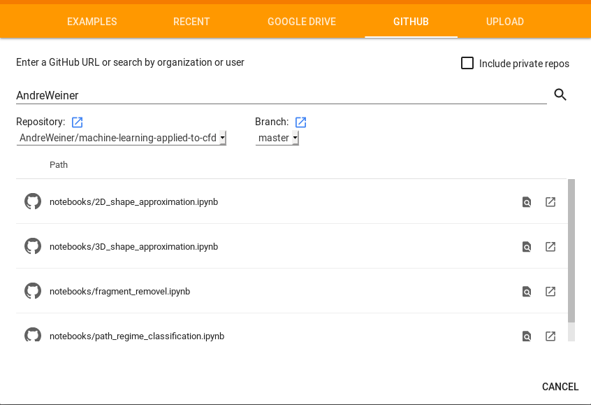

# machine-learning-applied-to-cfd

## Introduction

This repository contains examples of how to use machine learning (ML) algorithms
in the field of computational fluid dynamics (CFD). ML algorithms may be applied in different steps during a CFD-based study:

- **pre-processing**, e.g., for geometry or mesh generation
- **run-time**, e.g., as a dynamic boundary condition or as a subgrid-scale model
- **post-processing**, e.g., to create substitute models or to analyze results

Another possible categorization is to distinguish the type of machine learning algorithm, e.g.

- **supervised learning:** the algorithm creates a mapping between given features and labels, e.g., between the shape of a truck and the drag force acting on it
- **unsupervised learning:** the algorithm finds labels in the data, e.g., if two particles *p1* and *p2* are represented by some points on their surface (there is only a list of points, but it is not known to which particle they belong), the algorithm will figure out for each point weather it belongs to *p1* or *p2*
- **reinforcement learning:** an agent acting in an environment tries to maximize a (cumulative) reward, e.g., an agent setting the solution control of a simulation tries to finish the simulation as quickly as possible, thereby learning to find optimized solution controls for a given set-up (*agent*: some program modifying the solver settings; *environment*: the solver reacting on the changes in the settings; *reward*: the inverse of the time required to complete one iteration)

## Dependencies

### Dependencies for Jupyter notebooks

Currently, there are two supported ways to execute the Jupyter notebooks contained in the *notebooks* folder:

1. via a local installation of [Anaconda](https://www.anaconda.com/distribution/)
2. via [Google Colab](https://colab.research.google.com/) (cloud-based)

Both approaches allow to the notebooks interactively and to save results.

### Running notebooks locally

The notebooks use the following Python packages, which can all be installed via pip or conda:

- Anaconda, Python 3.x version ([Link](https://www.anaconda.com/distribution/#download-section))
- NumPy v1.16, Pandas v0.24.2, Matplotlib v2.2.2, PyTorch v1.0.0, Scikit-Learn 0.19.1 or later versions

To install all packages using pip, run

```
pip3 install numpy matplotlib pandas scikit-learn
```

or using the conda installer, run
```
conda install numpy matplotlib pandas scikit-learn
```

For PyTorch, it is best to use the [graphical selection tool](https://pytorch.org/). Example install commands might be
```
# using pip
pip3 install torch torchvision
# using conda
conda install pytorch torchvision cudatoolkit=9.0 -c pytorch
```
for systems with Cuda support, or
```
# using pip
pip3 install https://download.pytorch.org/whl/cpu/torch-1.1.0-cp36-cp36m-linux_x86_64.whl
pip3 install https://download.pytorch.org/whl/cpu/torchvision-0.3.0-cp36-cp36m-linux_x86_64.whl
# using conda
conda install pytorch-cpu torchvision-cpu -c pytorch
```
for systems without GPU acceleration.

### Running notebooks with Colaboratory

Running notebooks in colab requires to have a Google account (the same account as for Gmail, Google Drive, and so on). Note, that it is also possible to display the notebooks with having an account (without interactivity). After logging in to colab, notebooks can be directly imported from Github (from this repository):

- File -> Open notebook...
- Select the *GITHUB* tab
- Search for *AndreWeiner*
- Select the notebook you want to import
- Click on **COPY TO DRIVE**

Without the last step, you will still be able to run and modify most of the cells in the notebooks, but you will not be able to run cells which store intermediate results, e.g. model weights. The import windows should look similar to the following:



### Dependencies for OpenFOAM cases and apps

Running and compiling OpenFOAM+PyTorch applications is enabled via a special [Docker](https://www.docker.com/) image. The Dockerfile to build the image is also available on [Github](https://github.com/AndreWeiner/of_pytorch_docker). First, install the latest version of Docker ([Ubuntu](https://docs.docker.com/install/linux/docker-ce/ubuntu/), [CentOS](https://docs.docker.com/install/linux/docker-ce/centos/)). The image is hosted on [Dockerhub](https://cloud.docker.com/u/andreweiner/repository/docker/andreweiner/of_pytorch) and can be downloaded by running

```
docker pull andreweiner/of_pytorch:of1906-py1.1-cpu
```

Currently, there is only a version with cpu support. To create and run a new container, go to the OpenFOAM folder and execute the *runContainer.sh* script:

```
cd OpenFOAM
./runContainer.sh
```
To compile or run applications, execute the scripts provided in the respective folders **from within the container**.

## Examples grouped by the type of learning

### Supervised learning

- **classification**: [path regime classification of rising bubbles](https://github.com/AndreWeiner/machine-learning-applied-to-cfd/blob/master/notebooks/path_regime_classification.ipynb)

### Unsupervised learning

### Reinforcement learning

## How to reference

If you found useful examples in this repository, you may consider citing the following reference:

```
@article{doi:10.1002/ceat.201900044,
author = {Weiner, Andre and Hillenbrand, Dennis and Marschall, Holger and Bothe, Dieter},
title = {Data-driven subgrid-scale modeling for convection-dominated concentration boundary layers},
journal = {Chemical Engineering \& Technology},
}
```

## Journal articles realted to ML + CFD

- [Nonlinear mode decomposition with machine learning for fluid dynamics (2019)](https://www.researchgate.net/publication/333679109_Nonlinear_mode_decomposition_with_machine_learning_for_fluid_dynamics)
- [Synthetic turbulent inflow generator using machine learning (2019)](https://www.researchgate.net/publication/333626382_Synthetic_turbulent_inflow_generator_using_machine_learning)
- [Super-resolution reconstruction of turbulent flows with machine learning (2019)](https://www.cambridge.org/core/journals/journal-of-fluid-mechanics/article/superresolution-reconstruction-of-turbulent-flows-with-machine-learning/0DEBFE07FD949054E7E5046AB5632F22)
- [Data‐driven subgrid‐scale modeling for convection‐dominated concentration boundary layers (2019)](https://onlinelibrary.wiley.com/doi/abs/10.1002/ceat.201900044)
- [Artificial neural networks trained through deep reinforcement learning discover control strategies for active flow control (2019)](https://www.cambridge.org/core/journals/journal-of-fluid-mechanics/article/artificial-neural-networks-trained-through-deep-reinforcement-learning-discover-control-strategies-for-active-flow-control/D5B80D809DFFD73760989A07F5E11039), [GITHUB](https://github.com/jerabaul29/Cylinder2DFlowControlDRL)
- [Turbulence Modeling in the Age of Data (2019)](https://www.annualreviews.org/doi/abs/10.1146/annurev-fluid-010518-040547)
- [Deep learning in fluid dynamics (2017)](https://www.cambridge.org/core/journals/journal-of-fluid-mechanics/article/deep-learning-in-fluid-dynamics/F2EDDAB89563DE5157FC4B8342AD9C70)

## More useful links

- Quora answer to [What are the hot topics in Fluid Dynamics involving Machine Learning?](https://www.quora.com/What-are-the-hot-topics-in-Fluid-Dynamics-involving-Machine-Learning/answer/Andre-Weiner-2)

## Other repositories with related content

- [Computational-Fluid-Dynamics-Machine-Learning-Examples](https://github.com/loliverhennigh/Computational-Fluid-Dynamics-Machine-Learning-Examples)

## Contributors

- [Andre Weiner](https://github.com/AndreWeiner), [Mail](weiner@mma.tu-darmstadt.de)
