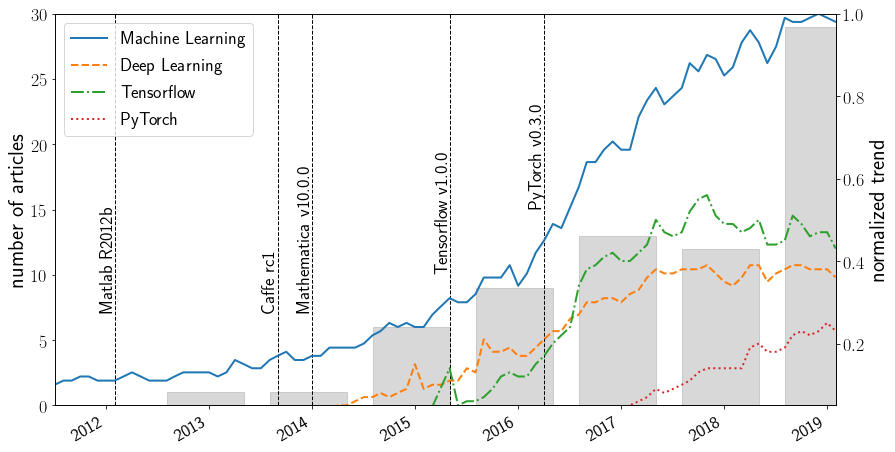

# Articles related to ML + CFD

## Outline

1. [Introduction](#introduction)
2. [Articles per year and trends](#articles_per_year)
3. [Abbreviations](#abbreviations)
4. [Articles](#articles)

## Introduction

The following list comprises articles related to computational fluid dynamics (CFD) and machine learning (ML). Some of the articles consider only heat and mass transfer or the solution of partial differential equations which are not strictly speaking *computational fluid dynamics*. There are also works where initial/boundary value problems are solved directly using machine learning without classical numerical techniques. Such articles are also listed here because they may contain techniques which help to improve data-driven CFD solutions. The articles are listed alphabetic order. There are many sensible ways to categorize articles, e.g. regarding the learning type (supervised, un-supervised, reinforced) or the physics of interest (turbulence, mass transfer, etc.). Therefore, each list item below contains a small description and several useful keywords to relate similar articles.

If you think there is some articles missing, if you would like to add/modify list items, or if you have general comments, please use the repository's [issue tracker](https://github.com/AndreWeiner/machine-learning-applied-to-cfd/issues).

## Articles per year and trends

The following graphic illustrates the correlation between published articles related to ML+CFD together with several ML Google trends. The figure suggests that there is a strong connection between the progress in research and the availability of easy-to-use software packages. This connections seems to be particularly strong for open source frameworks like Tensorflow and PyTorch.

The number of articles per year is based on the literature [list below](#articles). The trend curves were downloaded on the **26th of August 2019** (worldwide).

## Abbreviations

| Abbreveation | Meaning |
| :----------: | :------ |
| **ADT** | **A**daboost **D**ecision **T**ree |
| **BFGS**   | **B**royden **F**letcher **G**oldfarb **S**hanno method |
| **CNN** | **C**onvoloutional **N**eural **N**etwork |
| **DRL** | **D**eep **R**einforcement **L**earning |
| **DSC** | **D**ownsampled **S**kip **C**onnection |
| **GAN** | **G**enerative **A**dversarial **N**etwork |
| **KNN** | **K**-**N**earest **N**eighbors |
| **LASSO** | **L**east **A**bsolute **S**hrinkage and **S**election **O**perator |
| **LSTM** | **L**ong **S**hort **T**erm **M**emory |
| **MLP** | **M**ulti**l**ayer **P**erceptron |
| **MSN** | **M**ulti **S**cale **N**etwork  |
| **PINN** | **P**hysics **I**nformed **N**eural **N**etworks |
| **PCA** | **P**rincipal **C**omponent **A**nalysis |
| **RANS**  | **R**eynolds **A**veraged **N**avier **S**tokes |
| **RBNN** | **R**adial **B**asis Function **N**eural **N**etwork  |
| **RF**  | **R**andom **F**orest |
| **RNN**  | **R**ecurrent **N**eural **N**etwork |
| **ROC**  | **R**eceiver **O**perating **C**haracteristic |
| **SOM**  | **S**elf **O**rganizing **M**ap |
| **TBNN** | **T**ensor **B**asis **N**eural **N**etwork |

## Articles

M. **Alsalman** et al.: [Training bioinspired sensors to classify flows (2018)](https://iopscience.iop.org/article/10.1088/1748-3190/aaef1d)
- Aim: classification of flow patterns based on local vorticity measurements; influence of sensor types on accuracy of flow classification
- Learning type: supervised learning (classification)
- ML algorithms: MLP, SGD
- ML frameworks: Mathematica 11.1.1
- CFD framework: inhouse
- Combination of CFD + ML: post

S. **Bhatnagar** et al.: [Prediction of aerodynamic flow fields using convolutional neural networks (2019)](https://link.springer.com/article/10.1007%2Fs00466-019-01740-0)
- Aim: predict velocity and pressure in unseen flow conditions given the pixelated shape of the object; predict impact of airfoil shape on aerodynamic forces in near real time
- Learning type: supervised learning (regression)
- ML algorithms: CNN, parameter sharing, gradient sharpening
- ML frameworks: Caffe
- CFD framework: overturns cfd
- Combination of CFD + ML: post

S. L. **Brunton** et al.: [Discovering governing equations from data by sparse identification of nonlinear dynamical systems (2016)](https://www.pnas.org/content/113/15/3932)
- Aim: extract governing equations from noisy measurement data; use sparse regression to determine the fewest terms in the dynamic governing equations required to accurately represent the data; demonstration on linear and non-linear oscillators, chaotic Lorenz system, vortex shedding behind an obstacle
- Learning type: supervised learning (regression)
- ML algorithms: LASSO
- ML frameworks: Matlab
- CFD framework: inhouse
- Combination of CFD + ML: post

S. L. **Brunton** et al.: [Machine Learning for Fluid Mechanics (2019)](https://arxiv.org/abs/1905.11075)
- Aim: review article ML + fluid dynamics;
- Learning type: supervised learning, unsupervised learning, reinforcement learning
- ML algorithms: MLP, RNN, LSTM, PCA, SOM, k-means, GAN
- ML frameworks: -
- CFD framework: -
- Combination of CFD + ML: -

S. **Chanda** et al.: [Estimation of principal thermal conductivities of layered honeycomb composites using ANN-GA based inverse technique (2017)](https://www.sciencedirect.com/science/article/pii/S1290072916305841?via%3Dihub)
- Aim: estimation of principal thermal conductivities of layered honeycomb composite material; minimization of the difference between measured and computed temperatures
- Learning type: supervised learning (regression)
- ML algorithms: MLP
- ML frameworks: Matlab
- CFD framework: Matlab
- Combination of CFD + ML: interactively

C. W. **Chang** et al.: [A Study of Physics-Informed Deep Learning for System Fluid Dynamics Closures (2016)](https://www.researchgate.net/publication/311767999_A_Study_of_Physics-Informed_Deep_Learning_for_System_Fluid_Dynamics_Closures)
- Aim: study stability of DL-based closure models for fluid dynamics; test influence of activation function and model complexity
- Learning type: supervised learning (regression)
- ML algorithms: MLP
- ML frameworks: Tensorflow
- CFD framework: inhouse, Modelica
- Combination of CFD + ML: post

C. W. **Chang** et al.: [Classification of machine learning frameworks for data-driven thermal fluid models (2019)](https://www.sciencedirect.com/science/article/pii/S1290072917317672?via%3Dihub)
- Aim: classification system for usage of ML in data-driven modeling of thermal fluids; demonstrate ML-model types on thermal conductivity problem
- Learning type: supervised learning (regression)
- ML algorithms: MLP, CNN
- ML frameworks: Tensorflow
- CFD framework: inhouse, various
- Combination of CFD + ML: post, interactively

S. H. **Cheung** et al.: [Bayesian uncertainty analysis with applications to turbulence modeling (2011)](https://www.sciencedirect.com/science/article/pii/S0951832011000664)
- Aim: apply Bayesian uncertainty quantification to the process of calibrating mathematical models and the to prediction of quantities to interest; comparison of Spalart-Allmaras model clases in terms of their posterior probabilities to fit experimental observations; selection of appropriate model classes for given task
- Learning type: -
- ML algorithms: Bayesian statistics, markov chains
- ML frameworks: inhouse
- CFD framework: OpenFOAM
- Combination of CFD + ML: post

B. **Colvert** et al.: [Classifying vortex wakes using neural networks (2018)](https://iopscience.iop.org/article/10.1088/1748-3190/aaa787)
- Aim: flows contain information about objects creating them; classification of flow patterns based on local vorticity measurements
- Learning type: supervised learning (classification)
- ML algorithms: MLP, SGD
- ML frameworks: Mathematica 11.1.1
- CFD framework: inhouse
- Combination of CFD + ML: post

S. J. **Daniels** et al.: [A Suite of Computationally Expensive Shape Optimisation Problems Using Computational Fluid Dynamics (2018)](https://link.springer.com/chapter/10.1007%2F978-3-319-99259-4_24)
- Aim: create a set of computationally expensive benchmark test problems for design optimisation using CFD; development of a Python software package for parameterized geometry creation and object function computation
- Learning type: -
- ML algorithms: generic
- ML frameworks: generic
- CFD framework: OpenFOAM
- Combination of CFD + ML:

K. **Duraisamy** et al.: [Turbulence Modeling in the Age of Data (2019)](https://www.annualreviews.org/doi/full/10.1146/annurev-fluid-010518-040547)
- Aim: review article for developments in bounding uncertainties in RANS models via physical constrains, adopting statistical inference to characterize model coefficients and discrepancies, and in using machine learning to improve turbulence models;
- Learning type: -
- ML algorithms: -
- ML frameworks: -
- CFD framework: -
- Combination of CFD + ML: -

W. **Edeling** et al.: [Bayesian Predictions of Reynolds-Averaged Navier–Stokes Uncertainties Using Maximum a Posteriori Estimates (2018)](https://arc.aiaa.org/doi/abs/10.2514/1.J056287)
- Aim: Bayesian model-scenario averaging to combine the predictions of several competing models validated on various sets of data; stochastic estimate of a quantity of interest in an unmeasured prediction scenario
- Learning type: supervised learning (regression)
- ML algorithms: Bayesian averaging
- ML frameworks: -
- CFD framework: Fluent
- Combination of CFD + ML: post

N. B. **Erichson** et al.: [Physics-informed Autoencoders for Lyapunov-stable Fluid Flow Prediction (2019)](https://arxiv.org/abs/1905.10866)
- Aim: use physics-informed prior knowledge (Lyapunov stability) for improving model quality  (generalization performance, sensitivity to parameter tuning, robustness to noise)
- Learning type: supervised learning (regression)
- ML algorithms: MLP, Autoencoder
- ML frameworks: PyTorch
- CFD framework: -
- Combination of CFD + ML: post

K. **Fukami** et al.: [Super-resolution reconstruction of turbulent flows with machine learning (2019)](https://www.cambridge.org/core/journals/journal-of-fluid-mechanics/article/superresolution-reconstruction-of-turbulent-flows-with-machine-learning/0DEBFE07FD949054E7E5046AB5632F22)
- Aim: reconstruct laminar flow around a cylinder and 2D homogeneous turbulence  based on low-resolution simulation data
- Learning type: supervised learning (regression)
- ML algorithms: CNN, DSC, MSN, autoencoder
- ML frameworks: Tensorflow, Keras, Scikit Learn
- CFD framework: database
- Combination of CFD + ML: post

K. **Fukami** et al.: [Synthetic turbulent inflow generator using machine learning (2019)](https://journals.aps.org/prfluids/abstract/10.1103/PhysRevFluids.4.064603)
- Aim: generate time-dependent turbulent inflow data to replace conventional driver simulations or synthetic inflow generators; investigation of spurious periodicity; lower computational cost of DNS
- Learning type: supervised learning (regression)
- ML algorithms: autoencoder, CNN, MLP
- ML frameworks: Tensorflow, Keras, Scikit Learn
- CFD framework: inhouse
- Combination of CFD + ML:

P. **Garnier** et al.: [A review on Deep Reinforcement Learning for Fluid Mechanics (2019)](https://www.researchgate.net/publication/335135215_A_review_on_Deep_Reinforcement_Learning_for_Fluid_Mechanics?enrichId=rgreq-f81d3b4060722673d27e405be0651367-XXX&enrichSource=Y292ZXJQYWdlOzMzNTEzNTIxNTtBUzo3OTM1MDU5MzI3ODM2MjJAMTU2NjE5Nzk2NTk2MQ%3D%3D&el=1_x_2&_esc=publicationCoverPdf)
- Aim: review article of DRL application to fluid dynamics problems; discussion of advantages and disadvantages of different coupling methods (deep Q learning, policy gradients)
- Learning type: (deep) reinforcement learning
- ML algorithms: deep Q-networks, deep policy gradient, advantage actor-critic, proximal policy optimization
- ML frameworks: Tensorflow
- CFD framework: Fenics
- Combination of CFD + ML:

F. **Gueniat** et al.: [A statistical learning strategy for closed-loop control of fluid flows (2016)](https://link.springer.com/article/10.1007/s00162-016-0392-y)
- Aim: discuss closed-loop control for complex systems; derive Markov process model based on sensor measurements
- Learning type: reinforcement learning
- ML algorithms: Markov process, Q-learning
- ML frameworks: inhouse
- CFD framework: inhouse
- Combination of CFD + ML:

X. **Guo** et al.: [Convolutional Neural Networks for Steady Flow Approximation (2016)](https://autodeskresearch.com/publications/convolutional-neural-networks-steady-flow-approximation)
- Aim: real-time prediction of non-uniform steady laminar flow in a 2D or 3D domain based on CNNs; explore alternatives for geometry representation
- Learning type: supervised learning
- ML algorithms: CNN
- ML frameworks: Caffe
- CFD framework: OpenLB
- Combination of CFD + ML: post

B. N. **Hanna** et al.: [Coarse-Grid Computational Fluid Dynamics Error Prediction using Machine Learning (2017)](https://arxiv.org/abs/1710.09105)
- Aim: ML-based surrogate model for the prediction of errors in coarse grid CFD simulations; application to 3D lid-driven cavity
- Learning type: supervised learning (regression)
- ML algorithms: MLP, RF regression
- ML frameworks: inhouse
- CFD framework: OpenFOAM
- Combination of CFD + ML: post

J. R. **Holland** et al.: [Towards Integrated Field Inversion and Machine Learning With Embedded Neural Networks for RANS Modeling (2019)](https://arc.aiaa.org/doi/abs/10.2514/6.2019-1884)
- Aim: reduce model form errors in RANS simulations; integrate learning step into field inversion process; reduce training time by "layered approach"
- Learning type: supervised learning (regression)
- ML algorithms: MLP
- ML frameworks: inhouse
- CFD framework: SU2
- Combination of CFD + ML:

K. **Jambunathan** et al.: [Evaluating convective heat transfer coefficients using neural networks (1996)](https://www.sciencedirect.com/science/article/pii/0017931095003320)
- Aim: predict heat transfer coefficients based on temperature measurements over time; generate explicit relationship for heat transfer coefficients based on neural network
- Learning type: supervised learning (regression)
- ML algorithms: MLP
- ML frameworks: NeuralWorks Professional Plus
- CFD framework: -
- Combination of CFD + ML: post

M. L. A. **Kaandorp** et al.: [Stochastic Random Forests with Invariance for RANS Turbulence Modelling (2018)](https://arxiv.org/abs/1810.08794)
- Aim: predict Reynolds-stress anisotropy tensor while guaranteeing Galilean invariance by making use of the tensor basis; usage of random forest to detect outliers in training data, to prevent overfitting, and to provide uncertainty estimates;
- Learning type: supervised learning (regression, classification)
- ML algorithms: RF, MLP
- ML frameworks: not specified
- CFD framework: OpenFOAM
- Combination of CFD + ML: post, interactively

B. **Kim** et al.: [Deep Fluids: A Generative Network for Parameterized Fluid Simulations (2019)](https://arxiv.org/abs/1806.02071)
- Aim: synthesize fluid simulations from a set of reduced parameters; propose loss function that guarantees divergence-free velocity fields; handle complex parameterizations in reduced spaces and advance simulations in time by integrating the latent space with a second network
- Learning type: supervised learning (regression), unsupervised learning
- ML algorithms: CNN, autoencoder, MLP, GAN
- ML frameworks: Tensorflow
- CFD framework: Mantaflow
- Combination of CFD + ML:

J. N. **Kutz** et al.: [Deep learning in fluid dynamics (2017)](https://www.cambridge.org/core/journals/journal-of-fluid-mechanics/article/deep-learning-in-fluid-dynamics/F2EDDAB89563DE5157FC4B8342AD9C70)
- Aim: short overview article for deep learning in turbulence modeling; pose open questions regarding data-driven models
- Learning type: -
- ML algorithms: -
- ML frameworks: -
- CFD framework: -
- Combination of CFD + ML: -

L. **Ladicky** et al.: [Data-driven Fluid Simulations using Regression Forests (2015)](https://dl.acm.org/citation.cfm?doid=2816795.2818129)
- Aim: formulate machine learning and physics based fluid simulation as regression problem for time-critical simulations
- Learning type: supervised learning (regression)
- ML algorithms: RF
- ML frameworks: not specified
- CFD framework: PCISPH
- Combination of CFD + ML: post

I. E. **Lagaris** et al.: [Artificial Neural Networks for Solving Ordinary and Partial Differential Equations (1998)](https://pdfs.semanticscholar.org/5ebb/e0b1a3d7a2431bbb25d6dfeec7ed6954d633.pdf)
- Aim: formulate IBVs as optimization problem; approximate ODE (system) PDS solution based on neural networks; compare to finite elements
- Learning type: supervised learning (regression)
- ML algorithms: MLP, BFGS
- ML frameworks: Merlin
- CFD framework: inhouse
- Combination of CFD + ML: post

I. E. **Lagaris** et al.: [Neural-Network Methods for Boundary ValueProblems with Irregular Boundaries (2000)](https://ieeexplore.ieee.org/stamp/stamp.jsp?tp=&arnumber=870037)
- Aim: approximate solution of IBV problems on irregular domains; test on 2D and 3D domains
- Learning type: supervised learning (regression)
- ML algorithms: MLP, RBNN
- ML frameworks: Merlin
- CFD framework: -
- Combination of CFD + ML: -

J. **Ling** et al.: [Evaluation of machine learning algorithms for prediction of regions of high Reynolds averaged Navier Stokes uncertainty (2015)](https://aip.scitation.org/doi/10.1063/1.4927765)
- Aim: train ML algorithms to identify regions of high RANS uncertainty; point-by-point classification of high or low uncertainty; show that classifiers can generalize to flows substantially different from training data
- Learning type: supervised learning (classification)
- ML algorithms: SVM, ADT, RF, ROC
- ML frameworks: Scikit Learn
- CFD framework: Fluent 12.0, Sierra Fuego, Sigma CFD
- Combination of CFD + ML: post

J. **Ling** et al.: [Reynolds averaged turbulence modelling using deep neural networks with embedded invariance (2016)](https://www.cambridge.org/core/journals/journal-of-fluid-mechanics/article/reynolds-averaged-turbulence-modelling-using-deep-neural-networks-with-embedded-invariance/0B280EEE89C74A7BF651C422F8FBD1EB)
- Aim: learn a model for the Reynolds stress anisotropy from high-fidelity simulation data; propose neural network architecture with invariant tensor basis to embed Galilean invariance of predicted anisotropy tensor
- Learning type: supervised learning (regression)
- ML algorithms: MLP, TBNN
- ML frameworks: FFNet
- CFD framework: Fluent, database
- Combination of CFD + ML: post, interactively

J. **Ling** et al.: [Machine learning strategies for systems with invariance properties (2016)](https://www.sciencedirect.com/science/article/pii/S0021999116301309?via%3Dihub)
- Aim: address machine learning for systems with symmetry or invariance properties; explore two ways of incorporating invariance in models: based on invariant features and based on specifically transformed data
- Learning type: supervised learning (regression)
- ML algorithms: RF, MLP
- ML frameworks: scikit-learn, FFNet
- CFD framework: Fluent 12.0
- Combination of CFD + ML: post

J. C. **Loiseau** et al.: [Constrained sparse Galerkin regression (2018)](https://www.cambridge.org/core/journals/journal-of-fluid-mechanics/article/constrained-sparse-galerkin-regression/0E18A4A55FF5AC1401D236C0E4D1CAAE)
- Aim: combine approach for creation of nonlinear low-order models with dimensionality reduction and enforce physical constraints in the regression; create method without need for high-fidelity data
- Learning type: supervised learning (regression)
- ML algorithms: PCA, LASSO
- ML frameworks: scikit-learn
- CFD framework: database
- Combination of CFD + ML: post

L. **Lu** et al.: [DeepXDE: A deep learning library for solving differential equations (2019)](https://arxiv.org/abs/1907.04502)
- Aim: propose a residual-based adaptive refinement to improve training efficiency of PINNs; present a Python library for PINNs
- Learning type: supervised learning (regression)
- ML algorithms: MLP
- ML frameworks: DeepXDE, Tensorflow
- CFD framework: -
- Combination of CFD + ML: -

M. **Ma** et al.: [Using statistical learning to close two-fluid multiphase flow equations for bubbly flows in vertical channels (2015)](https://aip.scitation.org/doi/10.1063/1.4930004)
- Aim:
- Learning type:
- ML algorithms:
- ML frameworks:
- CFD framework:
- Combination of CFD + ML:
-
M. **Ma** et al.: [Using statistical learning to close two-fluid multiphase flow equations for bubbly flows in vertical channels (2016)](https://www.sciencedirect.com/science/article/pii/S0301932215302226?via%3Dihub)
- Aim:
- Learning type:
- ML algorithms:
- ML frameworks:
- CFD framework:
- Combination of CFD + ML:

P. **Ma** et al.: [Fluid Directed Rigid Body Control using Deep Reinforcement Learning (2018)](https://dl.acm.org/citation.cfm?id=3201334)
- Aim:
- Learning type:
- ML algorithms:
- ML frameworks:
- CFD framework:
- Combination of CFD + ML:

R. **Maulik** et al.: [Subgrid modelling for two-dimensional turbulence using neural networks (2019)](https://www.cambridge.org/core/journals/journal-of-fluid-mechanics/article/subgrid-modelling-for-twodimensional-turbulence-using-neural-networks/10EDED1AEAA52C35F3E3A3BB6DC218C1)
- Aim:
- Learning type:
- ML algorithms:
- ML frameworks:
- CFD framework:
- Combination of CFD + ML:

M. **Milano** et al.: [Neural Network Modeling for Near Wall Turbulent Flow (2002)](https://www.sciencedirect.com/science/article/pii/S0021999102971469)
- Aim:
- Learning type:
- ML algorithms:
- ML frameworks:
- CFD framework:
- Combination of CFD + ML:

K. **Mills** et al.: [Deep learning and the Schrödinger equation (2017)](https://journals.aps.org/pra/abstract/10.1103/PhysRevA.96.042113)
- Aim:
- Learning type:
- ML algorithms:
- ML frameworks:
- CFD framework:
- Combination of CFD + ML:

M. **Moioli** et al.: [Parametric data-based turbulence modelling for vortex dominated flows (2019)](https://www.tandfonline.com/doi/full/10.1080/10618562.2019.1617857?scroll=top&needAccess=true)
- Aim:
- Learning type:
- ML algorithms:
- ML frameworks:
- CFD framework:
- Combination of CFD + ML:

T. **Murata** et al.: [Nonlinear mode decomposition with machine learning for fluid dynamics (2019)](https://arxiv.org/abs/1906.04029)
- Aim:
- Learning type:
- ML algorithms:
- ML frameworks:
- CFD framework:
- Combination of CFD + ML:

G. **Novati** et al.: [Synchronisation through learning for two self-propelled swimmers (2017)](https://iopscience.iop.org/article/10.1088/1748-3190/aa6311)
- Aim:
- Learning type:
- ML algorithms:
- ML frameworks:
- CFD framework:
- Combination of CFD + ML:

E. J. **Parish** et al.: [A paradigm for data-driven predictive modeling using field inversion and machine learning (2016)](https://www.sciencedirect.com/science/article/pii/S0021999115007524?via%3Dihub)
- Aim:
- Learning type:
- ML algorithms:
- ML frameworks:
- CFD framework:
- Combination of CFD + ML:

S. **Pierret** et al.: [Turbomachinery Blade Design Using a Navier–Stokes Solver and Artificial Neural Network (1999)](https://asmedigitalcollection.asme.org/turbomachinery/article-abstract/121/2/326/418791/Turbomachinery-Blade-Design-Using-a-Navier-Stokes?redirectedFrom=fulltext)
- Aim:
- Learning type:
- ML algorithms:
- ML frameworks:
- CFD framework:
- Combination of CFD + ML:

Y. **Qi** et al.: [Computing curvature for volume of fluid methods using machine learning (2019)](https://www.sciencedirect.com/science/article/pii/S0021999118307046?via%3Dihub)
- Aim:
- Learning type:
- ML algorithms:
- ML frameworks:
- CFD framework:
- Combination of CFD + ML:

J. **Rabault** et al.: [Artificial neural networks trained through deep reinforcement learning discover control strategies for active flow control (2019)](https://www.cambridge.org/core/journals/journal-of-fluid-mechanics/article/artificial-neural-networks-trained-through-deep-reinforcement-learning-discover-control-strategies-for-active-flow-control/D5B80D809DFFD73760989A07F5E11039)
- Aim:
- Learning type:
- ML algorithms:
- ML frameworks:
- CFD framework:
- Combination of CFD + ML:

J. **Rabault** et al.: [Accelerating Deep Reinforcement Leaning strategies of Flow Control through a multi-environment approach (2019)](https://www.researchgate.net/publication/333995531_Accelerating_Deep_Reinforcement_Leaning_strategies_of_Flow_Control_through_a_multi-environment_approach)
- Aim:
- Learning type:
- ML algorithms:
- ML frameworks:
- CFD framework:
- Combination of CFD + ML:

M. **Raissi** et al.: [Hidden physics models: Machine learning of nonlinear partial differential equations (2018)](https://www.sciencedirect.com/science/article/pii/S0021999118307125)
- Aim:
- Learning type:
- ML algorithms:
- ML frameworks:
- CFD framework:
- Combination of CFD + ML:

M. **Raissi** et al.: [Numerical Gaussian Processes for Time-Dependent and Nonlinear Partial Differential Equations (2018)](https://epubs.siam.org/doi/10.1137/17M1120762)
- Aim:
- Learning type:
- ML algorithms:
- ML frameworks:
- CFD framework:
- Combination of CFD + ML:

M. **Raissi** et al.: [Deep Learning of Turbulent Scalar Mixing (2018)](https://arxiv.org/abs/1811.07095)
- Aim:
- Learning type:
- ML algorithms:
- ML frameworks:
- CFD framework:
- Combination of CFD + ML:

M. **Raissi** et al.: [Physics-informed neural networks: A deep learning framework for solving forward and inverse problems involving nonlinear partial differential equations (2019)](https://www.sciencedirect.com/science/article/pii/S0021999118307125)
- Aim:
- Learning type:
- ML algorithms:
- ML frameworks:
- CFD framework:
- Combination of CFD + ML:

J. **Ray** et al.: [Bayesian calibration of a k-e turbulence model for predictive jet-in-crossflow simulations (2016)](https://arc.aiaa.org/doi/10.2514/1.J054758)
- Aim:
- Learning type:
- ML algorithms:
- ML frameworks:
- CFD framework:
- Combination of CFD + ML:

K. **Rudd** et al.: [A Constrained Backpropagation Approach for the Adaptive Solution of Partial Differential Equations (2014)](https://ieeexplore.ieee.org/document/6658964)
- Aim:
- Learning type:
- ML algorithms:
- ML frameworks:
- CFD framework:
- Combination of CFD + ML:

K. **Rudd** et al.: [A constrained integration (CINT) approach to solving partial differential equations using artificial neural networks (2015)](https://www.sciencedirect.com/science/article/pii/S092523121401652X)
- Aim:
- Learning type:
- ML algorithms:
- ML frameworks:
- CFD framework:
- Combination of CFD + ML:

S. H. **Rudy** et al.: [Data-driven discovery of partial differential equations (2017)](https://advances.sciencemag.org/content/3/4/e1602614)
- Aim:
- Learning type:
- ML algorithms:
- ML frameworks:
- CFD framework:
- Combination of CFD + ML:

H. **Schaefer**: [Learning partial differential equations via data discovery and sparse optimization (2017)](https://royalsocietypublishing.org/doi/10.1098/rspa.2016.0446)
- Aim:
- Learning type:
- ML algorithms:
- ML frameworks:
- CFD framework:
- Combination of CFD + ML:

M. **Schmelzer** et al.: [Machine Learning of Algebraic Stress Models using Deterministic Symbolic Regression (2019)](https://www.researchgate.net/publication/333236696_Machine_Learning_of_Algebraic_Stress_Models_using_Deterministic_Symbolic_Regression)
- Aim:
- Learning type:
- ML algorithms:
- ML frameworks:
- CFD framework:
- Combination of CFD + ML:

Y. B. **Sinai** et al.: [Learning data-driven discretizations for partial differential equations (2019)](https://www.pnas.org/content/116/31/15344)
- Aim:
- Learning type:
- ML algorithms:
- ML frameworks:
- CFD framework:
- Combination of CFD + ML:

A. P. **Singh** et al.: [Machine-Learning-Augmented Predictive Modeling of Turbulent Separated Flows over Airfoils  (2017)](https://arc.aiaa.org/doi/pdf/10.2514/1.J055595)
- Aim:
- Learning type:
- ML algorithms:
- ML frameworks:
- CFD framework:
- Combination of CFD + ML:

A. P. **Singh** et al.: [Characterizing and Improving Predictive Accuracy in Shock-Turbulent Boundary Layer Interactions Using Data-driven Models (2017)](https://arc.aiaa.org/doi/abs/10.2514/6.2017-0314)
- Aim:
- Learning type:
- ML algorithms:
- ML frameworks:
- CFD framework:
- Combination of CFD + ML:

C. M. **Stroefer** et al.: [Data-Driven, Physics-Based Feature Extraction from Fluid Flow Fields (2018)](https://arxiv.org/abs/1802.00775)
- Aim:
- Learning type:
- ML algorithms:
- ML frameworks:
- CFD framework:
- Combination of CFD + ML:

L. **Sun** et al.: [On developing data-driven turbulence model for DG solution of RANS (2019)](https://www.sciencedirect.com/science/article/pii/S1000936119301621?via%3Dihub)
- Aim:
- Learning type:
- ML algorithms:
- ML frameworks:
- CFD framework:
- Combination of CFD + ML:

L. **Sun** et al.: [Surrogate Modeling for Fluid Flows Based on Physics-Constrained Deep Learning Without Simulation Data (2019)](https://www.researchgate.net/publication/333649855_Surrogate_Modeling_for_Fluid_Flows_Based_on_Physics-Constrained_Deep_Learning_Without_Simulation_Data)
- Aim:
- Learning type:
- ML algorithms:
- ML frameworks:
- CFD framework:
- Combination of CFD + ML:

J. **Tompson** et al.: [Accelerating Eulerian Fluid Simulation With Convolutional Networks (2017)](https://dl.acm.org/citation.cfm?id=3306035)
- Aim:
- Learning type:
- ML algorithms:
- ML frameworks:
- CFD framework:
- Combination of CFD + ML:

B. D. **Tracey** et al.: [Application of Supervised Learning to Quantify Uncertainties in Turbulence and Combustion Modeling (2013)](https://arc.aiaa.org/doi/abs/10.2514/6.2013-259)
- Aim:
- Learning type:
- ML algorithms:
- ML frameworks:
- CFD framework:
- Combination of CFD + ML:

B. D. **Tracey** et al.: [A Machine Learning Strategy to Assist Turbulence Model Development (2015)](https://arc.aiaa.org/doi/abs/10.2514/6.2015-1287)
- Aim:
- Learning type:
- ML algorithms:
- ML frameworks:
- CFD framework:
- Combination of CFD + ML:

G. **Tryggvason** et al.: [DNS–Assisted Modeling of Bubbly Flows in Vertical Channels (2017)](https://www.tandfonline.com/doi/abs/10.13182/NSE16-10)
- Aim:
- Learning type:
- ML algorithms:
- ML frameworks:
- CFD framework:
- Combination of CFD + ML:

S. **Verma** et al.: [Efficient collective swimming by harnessing vortices through deep reinforcement learning (2018)](https://www.pnas.org/content/115/23/5849)
- Aim:
- Learning type:
- ML algorithms:
- ML frameworks:
- CFD framework:
- Combination of CFD + ML:

J. **Viquerat** et al.: [Direct shape optimization through deep reinforcement learning (2019)](https://www.researchgate.net/publication/335430058_DIRECT_SHAPE_OPTIMIZATION_THROUGH_DEEP_REINFORCEMENT_LEARNING?_iepl%5BactivityId%5D=1143115285139465&_iepl%5BactivityTimestamp%5D=1566980522&_iepl%5BactivityType%5D=person_add_feedback_publication&_iepl%5Bcontexts%5D%5B0%5D=homeFeed&_iepl%5BrecommendationActualVariant%5D=&_iepl%5BrecommendationDomain%5D=&_iepl%5BrecommendationScore%5D=&_iepl%5BrecommendationTargetActivityCombination%5D=&_iepl%5BrecommendationType%5D=&_iepl%5BfeedVisitIdentifier%5D=&_iepl%5BpositionInFeed%5D=2&_iepl%5BsingleItemViewId%5D=Q2hzZ1HiELgYMBejWB1ZSiVc&_iepl%5BviewId%5D=s4cXeT695Pzlig16QVzHUyvr&_iepl%5BhomeFeedVariantCode%5D=ncls&_iepl%5B__typename%5D=HomeFeedTrackingPayload&_iepl%5BinteractionType%5D=publicationOpenViewer&_iepl%5BtargetEntityId%5D=PB%3A335430058)
- Aim:
- Learning type:
- ML algorithms:
- ML frameworks:
- CFD framework:
- Combination of CFD + ML:

J. X. **Wang** et al.: [Physics-informed machine learning approach for reconstructing Reynolds stress modeling discrepancies based on DNS data (2017)](https://journals.aps.org/prfluids/abstract/10.1103/PhysRevFluids.2.034603)
- Aim:
- Learning type:
- ML algorithms:
- ML frameworks:
- CFD framework:
- Combination of CFD + ML:

M. **Wang** et al.: [Detecting exotic wakes with hydrodynamic sensors (2019)](https://link.springer.com/article/10.1007%2Fs00162-019-00493-z)
- Aim: wake sensing for exotic wake types that arise in swimming; classification library to classify unknown wakes from hydrodynamic signal measurements; locomotion control
- Learning type: supervised learning (classification)
- ML algorithms: KNN
- ML frameworks: inhouse
- CFD framework: inhouse
- Combination of CFD + ML: post

A. **Weiner** et al.: [Data‐Driven Subgrid‐Scale Modeling for Convection‐Dominated Concentration Boundary Layers (2019)](https://onlinelibrary.wiley.com/doi/10.1002/ceat.201900044)
- Aim:
- Learning type:
- ML algorithms:
- ML frameworks:
- CFD framework:
- Combination of CFD + ML:

J. L. **Wu** et al.: [A Priori Assessment of Prediction Confidence for Data-Driven Turbulence Modeling (2017)](https://link.springer.com/article/10.1007/s10494-017-9807-0)
- Aim:
- Learning type:
- ML algorithms:
- ML frameworks:
- CFD framework:
- Combination of CFD + ML:

H. **Xiao** et al.: [Quantifying and reducing model-form uncertainties in Reynolds-averaged Navier–Stokes simulations: A data-driven, physics-informed Bayesian approach (2019)](https://www.sciencedirect.com/science/article/pii/S0021999116303394?via%3Dihub)
- Aim:
- Learning type:
- ML algorithms:
- ML frameworks:
- CFD framework:
- Combination of CFD + ML:

Z. J. **Zhang** et al.: [Machine Learning Methods for Data-Driven Turbulence Modeling (2015)](https://arc.aiaa.org/doi/abs/10.2514/6.2015-2460)
- Aim:
- Learning type:
- ML algorithms:
- ML frameworks:
- CFD framework:
- Combination of CFD + ML:
